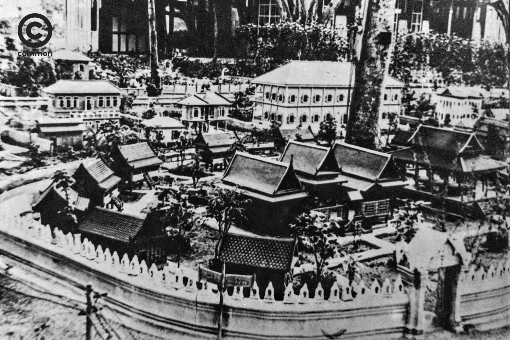

# ดุสิตธานี.git: เมืองจำลองประชาธิปไตยบน GitHub

> รูปจาก [becommon.co](https://becommon.co/culture/dusit-thani-kingramavi-intown)

> **ดุสิตธานี** เป็นเมืองจำลองรูปแบบระบอบประชาธิปไตย ที่พระบาทสมเด็จพระมงกุฎเกล้าเจ้าอยู่หัว ทรงสร้างขึ้นเมื่อวันที่ 21 กรกฎาคม พ.ศ. 2461 บริเวณพระราชวังพญาไท ดุสิตธานีเป็นเมืองเล็ก ๆ มีเนื้อที่ 3 ไร่ ตั้งอยู่บริเวณรอบพระที่นั่งอุดร ในพระราชวังดุสิต มีลักษณะเป็นเมืองเล็ก ๆ คล้ายเมืองตุ๊กตา มีขนาดพื้นที่ 1 ใน 20 เท่าของเมืองจริง ประกอบด้วย พระราชวัง ศาลารัฐบาล วัดวาอาราม สถานที่ราชการ โรงทหาร โรงเรียน โรงพยาบาล ตลาดร้านค้า ธนาคาร โรงละคร ประมาณเกือบสองร้อยหลัง เพื่อเป็นแบบทดลองของการปกครองระบอบประชาธิปไตย - [Wikipedia](https://th.wikipedia.org/wiki/ดุสิตธานี)
